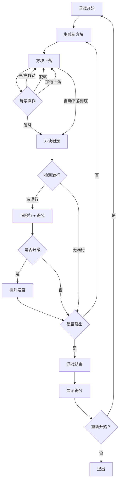

## 1. 产品概述

俄罗斯方块（Tetris）是一款经典的休闲益智游戏，玩家通过旋转和移动不同形状的方块，使其在底部拼成完整的行来消除得分。
- 目标用户：所有年龄段的游戏爱好者，寻找轻松休闲体验的玩家
- 产品价值：提供流畅、美观、具有沉浸感的经典方块消除体验

## 2. 核心功能

### 2.1 功能模块

1. **游戏主页面**：游戏画布、分数面板、下一个方块预览、操作控制
2. **游戏结束页面**：最终得分、重新开始按钮

### 2.2 页面详情

| 页面名称 | 模块名称 | 功能描述 |
|----------|----------|----------|
| 游戏主页面 | 游戏画布 | 10×20 的网格游戏区域，方块从顶部下落，支持左右移动、旋转、加速下落和硬降 |
| 游戏主页面 | 分数面板 | 实时显示当前分数、已消除行数、当前等级 |
| 游戏主页面 | 下一个方块预览 | 显示即将出现的下一个方块形状 |
| 游戏主页面 | 操作控制 | 键盘控制（方向键+空格）+ 触屏按钮控制 |
| 游戏主页面 | 暂停/继续 | 暂停游戏和继续游戏功能 |
| 游戏结束页面 | 得分展示 | 显示最终得分和消除行数统计 |
| 游戏结束页面 | 重新开始 | 一键重新开始新游戏 |

## 3. 核心流程

玩家进入游戏后，方块从顶部随机生成并自动下落。玩家通过键盘或触屏控制方块的位置和旋转，使方块在底部排列。当一行被完全填满时，该行消除并得分。随着消除行数增加，等级提升，下落速度加快。当方块堆叠到顶部时，游戏结束。

## 4. 用户界面设计

### 4.1 设计风格

- **主题**：赛博朋克/霓虹复古风 — 深色背景搭配霓虹发光效果，致敬经典街机美学
- **主色**：深黑底色 `#0a0a0f`，霓虹青 `#00f0ff`，霓虹粉 `#ff2d75`，霓虹黄 `#f0f000`
- **方块颜色**：7 种方块各有独特霓虹色 — I型青色、O型黄色、T型紫色、S型绿色、Z型红色、J型蓝色、L型橙色
- **按钮风格**：圆角霓虹边框按钮，hover 时发光增强
- **字体**：像素风/等宽字体，如 `Press Start 2P`（标题）+ `JetBrains Mono`（数据）
- **布局**：居中布局，左侧游戏区域，右侧信息面板
- **动画**：行消除时闪烁动画，方块锁定时微震动，得分增加时数字弹跳

### 4.2 页面设计概览

| 页面名称 | 模块名称 | UI 元素 |
|----------|----------|---------|
| 游戏主页面 | 游戏画布 | 深色网格背景，霓虹色方块带发光效果，网格线微弱可见 |
| 游戏主页面 | 分数面板 | 霓虹边框卡片，数字使用等宽字体，得分变化时弹跳动画 |
| 游戏主页面 | 下一个方块预览 | 小型网格区域，显示下一个方块轮廓 |
| 游戏主页面 | 操作控制 | 底部触屏方向按钮（移动端），半透明霓虹风格 |
| 游戏结束页面 | 得分展示 | 大号霓虹文字显示最终得分，消除行数统计 |
| 游戏结束页面 | 重新开始 | 霓虹发光按钮，hover 时脉冲动画 |

### 4.3 响应式设计

- 桌面端优先，键盘操控为主
- 移动端自适应：游戏区域缩放，底部显示虚拟方向键
- 触屏优化：按钮足够大，支持滑动操作

### 4.4 音效与反馈

- 方块旋转音效
- 行消除音效 + 闪烁视觉反馈
- 硬降音效 + 震动反馈
- 游戏结束音效
