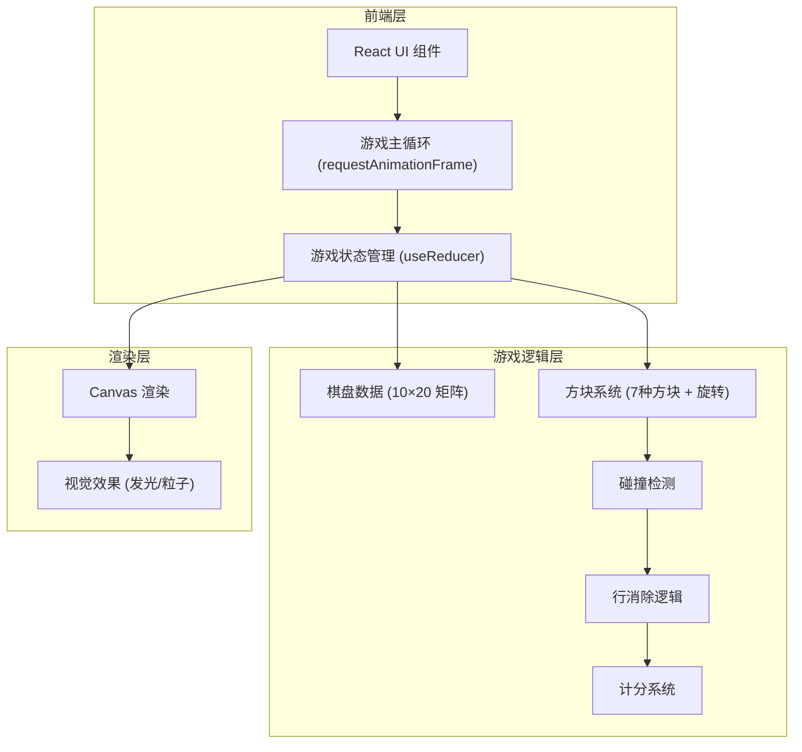

## 1. 架构设计



## 2. 技术说明

- **前端**：React@18 + Tailwind CSS@3 + Vite
- **初始化工具**：Vite (vite-init)
- **后端**：无（纯前端游戏）
- **数据库**：无（状态保存在 localStorage）
- **渲染**：HTML Canvas 2D 渲染游戏画面，React 组件渲染 UI 面板
- **状态管理**：React useReducer 管理游戏状态

## 3. 路由定义

| 路由 | 用途 |
|------|------|
| `/` | 游戏主页面（包含游戏画布、分数面板、预览区） |

## 4. 核心数据结构

### 4.1 方块定义

```typescript
type TetrominoType = 'I' | 'O' | 'T' | 'S' | 'Z' | 'J' | 'L';

interface Tetromino {
  type: TetrominoType;
  shape: number[][];     // 旋转状态矩阵
  color: string;         // 霓虹色
  x: number;             // 棋盘 x 坐标
  y: number;             // 棋盘 y 坐标
  rotation: number;      // 当前旋转状态 0-3
}
```

### 4.2 游戏状态

```typescript
interface GameState {
  board: (string | null)[][];  // 10×20 棋盘，null 为空，string 为颜色
  currentPiece: Tetromino | null;
  nextPiece: Tetromino | null;
  score: number;
  lines: number;
  level: number;
  isPlaying: boolean;
  isPaused: boolean;
  isGameOver: boolean;
  dropInterval: number;        // 下落间隔（毫秒）
}
```

### 4.3 计分规则

| 操作 | 得分 |
|------|------|
| 消除 1 行 | 100 × 等级 |
| 消除 2 行 | 300 × 等级 |
| 消除 3 行 | 500 × 等级 |
| 消除 4 行 | 800 × 等级 |
| 软降（每格） | 1 |
| 硬降（每格） | 2 |

### 4.4 等级与速度

| 等级 | 消除行数要求 | 下落间隔 |
|------|-------------|----------|
| 1 | 0 | 1000ms |
| 2 | 10 | 900ms |
| 3 | 20 | 800ms |
| ... | ... | ... |
| 10 | 90 | 100ms |

## 5. 项目文件结构

```
src/
├── components/
│   ├── GameBoard.tsx        # Canvas 游戏画布组件
│   ├── GameInfo.tsx         # 分数/等级/行数面板
│   ├── NextPiece.tsx        # 下一个方块预览
│   ├── Controls.tsx         # 移动端触屏控制
│   ├── GameOver.tsx         # 游戏结束弹窗
│   └── StartScreen.tsx      # 开始界面
├── hooks/
│   ├── useGameLoop.ts       # 游戏主循环 hook
│   └── useKeyboard.ts       # 键盘输入 hook
├── game/
│   ├── constants.ts         # 游戏常量（方块形状、颜色等）
│   ├── tetrominoes.ts       # 7种方块定义与旋转
│   ├── board.ts             # 棋盘操作（碰撞检测、行消除）
│   ├── score.ts             # 计分逻辑
│   └── gameReducer.ts       # 游戏状态 reducer
├── App.tsx                  # 主应用组件
├── main.tsx                 # 入口文件
└── index.css                # 全局样式 + Tailwind
```
